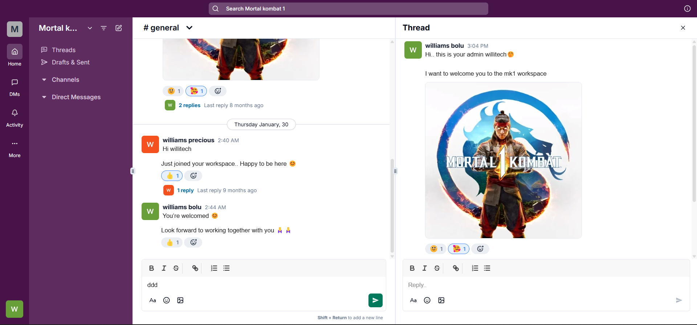

# Slack Clone

A real-time Slack-like messaging application built with Next.js, Convex, and Tailwind CSS. This project features workspaces, channels, direct messaging, message threading, reactions, and image uploads.



## 🚀 Tech Stack

- **Frontend**: [Next.js](https://nextjs.org/) (App Router), [React](https://react.dev/), [Tailwind CSS](https://tailwindcss.com/)
- **Backend/Database**: [Convex](https://www.convex.dev/) (Serverless Database & Functions)
- **Authentication**: [@convex-dev/auth](https://labs.convex.dev/auth)
- **State Management**: [Jotai](https://jotai.org/), [Nuqs](https://nuqs.47ng.com/)
- **UI Components**: [Radix UI](https://www.radix-ui.com/), [Lucide React](https://lucide.dev/), [Sonner](https://sonner.emilkowal.ski/)
- **Rich Text Editor**: [Quill](https://quilljs.com/)
- **Package Manager**: [Bun](https://bun.sh/)

## ✨ Features

- 🏢 **Workspaces**: Create and manage multiple workspaces.
- 💬 **Channels**: Organized conversations within workspaces.
- 👤 **Direct Messaging**: Private one-on-one conversations between members.
- 🧵 **Message Threads**: Reply to specific messages to keep conversations organized.
- 😀 **Reactions**: React to messages with emojis.
- 🖼️ **Image Uploads**: Share images within messages.
- 🔐 **Authentication**: Secure login and signup powered by Convex Auth.
- 📱 **Responsive Design**: Fully functional on desktop and mobile devices.
- ⚡ **Real-time Updates**: Instant messaging and updates via Convex's reactive engine.

## 📋 Prerequisites

Before you begin, ensure you have the following installed:
- [Bun](https://bun.sh/) (recommended) or Node.js/NPM
- A [Convex](https://www.convex.dev/) account

## 🛠️ Setup & Installation

1.  **Clone the repository:**
    ```bash
    git clone <repository-url>
    cd slack-tutorial
    ```

2.  **Install dependencies:**
    ```bash
    bun install
    ```

3.  **Setup Convex:**
    Initialize the Convex project and follow the CLI prompts to link your account.
    ```bash
    bunx convex dev
    ```
    This will also generate your `.env.local` file with the required `NEXT_PUBLIC_CONVEX_URL`.

4.  **Configure Environment Variables:**
    Ensure your `.env.local` includes:
    ```env
    NEXT_PUBLIC_CONVEX_URL=your-convex-deployment-url
    CONVEX_SITE_URL=your-auth-site-url # Typically set during Convex Auth setup
    ```

## 📖 Available Scripts

- `bun run dev`: Runs the Next.js development server.
- `bunx convex dev`: Runs the Convex development environment (watches for backend changes).
- `bun run build`: Builds the application for production.
- `bun run start`: Starts the production server.
- `bun run lint`: Runs ESLint for code quality checks.

## 📁 Project Structure

- `src/app`: Next.js App Router pages and layouts.
- `src/features`: Modular feature-based components, hooks, and stores (auth, workspaces, channels, etc.).
- `src/components`: Common UI components and providers.
- `src/hooks`: Custom React hooks.
- `src/lib`: Utility functions.
- `convex`: Convex backend functions (queries, mutations), schema, and authentication configuration.
- `public`: Static assets (images, icons).

## 🧪 Tests

Currently, there are no automated tests configured for this project.

---

Built with ❤️ by Williams
